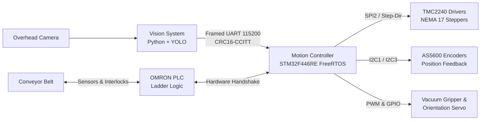

# XZ-Manipulator-Controls

**Integrasi Computer Vision dan Sistem Sortasi Konveyor untuk Pengendalian Kualitas (*Quality Control*) Komponen Kapasitor Berdasarkan Polaritas.**

Undergraduate Thesis Engineering Repository (*Tugas Akhir - Teknik Elektro / Sistem Komputer*).

---

## 1. System Overview

This repository houses the full-stack engineering implementation of an automated industrial inspection and sorting workcell for electrolytic capacitors:
1. **Perception & Quality Control:** Real-time overhead computer vision pipeline (YOLO + PCA continuous angle calculation) detecting capacitor polarity orientation and spatial coordinates on a moving conveyor belt.
2. **Motion & Actuation:** High-precision 2-Axis ($XZ$) Cartesian Manipulator driven by an STM32F446RE microcontroller running FreeRTOS, Trinamic TMC2240 SPI smart stepper drivers, AS5600 12-bit magnetic rotary encoders, and a pneumatic vacuum suction gripper.
3. **Conveyor & Material Handling:** Industrial conveyor workstation interlocked via an OMRON PLC running custom ladder logic.



---

## 2. Documentation Architecture

All core engineering specifications, protocols, wiring diagrams, and test guides are structured in [`docs/`](docs/):

```text
docs/
├── architecture/
│   ├── system_overview.md         # Detailed block diagrams and subsystem interaction lifecycle
│   └── communication_protocol.md  # 18-byte framed binary UART protocol & CRC16-CCITT specification
├── hardware/
│   ├── wiring.md                  # Master Nucleo-64, TMC2240, AS5600, and power wiring specification
│   └── bom_and_mechanics.md       # Bill of Materials, XZ gantry mechanics, and pneumatic specs
└── testing/
    └── test_methodology.md        # V-model test hierarchy, repeatability benchmarks, and acceptance criteria
```

---

## 3. Subsystems & Directory Layout

| Subsystem / Directory | Primary Role | Documentation |
| :--- | :--- | :--- |
| **[`MotorControls/`](MotorControls/)** | Motion control, stepper kinematics, and driver interfaces | [`MotorControls/README.md`](MotorControls/README.md) |
| ├── **[`MotionFirmware/`](MotorControls/MotionFirmware/)** | STM32F446RE FreeRTOS firmware, CMake/Ninja build, J-Link scripts | [`MotionFirmware/README.md`](MotorControls/MotionFirmware/README.md) |
| └── **[`Drivers/`](MotorControls/Drivers/)** | Modular, tested C drivers for TMC2240 and AS5600 encoders | [`AS5600/README.md`](MotorControls/Drivers/AS5600/README.md), [`TMC2240/README.md`](MotorControls/Drivers/TMC2240-Driver/README.md) |
| **[`VisionSystem/`](VisionSystem/)** | YOLO detection, PCA continuous angle calculation, conveyor tracking | [`VisionSystem/README.md`](VisionSystem/README.md) |
| **[`Program_Ladder/`](Program_Ladder/)** | OMRON PLC conveyor control ladder logic (CX-Programmer `.cxp`) | [`Program_Ladder/README.md`](Program_Ladder/README.md) |
| **[`Dokumentasi_Testing/`](Dokumentasi_Testing/)** | Real-case test matrices, experimental logs, and measurement sheets | [`Dokumentasi_Testing/README.md`](Dokumentasi_Testing/README.md) |

---

## 4. Quick Start Guide

### A. Vision System (Host PC)
Requires Python 3.12+ (managed deterministically via [`uv`](https://github.com/astral-sh/uv)):
```powershell
# 1. Setup virtual environment and dependencies
uv venv --python 3.12
.venv\Scripts\activate
uv pip install ultralytics opencv-python numpy pyserial pytest

# 2. Run real-time detection & telemetry stream
uv run python VisionSystem/04_Source_Code/4_detect_realtime.py

# 3. Run automated verification suite (Angle, CRC, Debounce)
uv run python VisionSystem/tests/verify_vision_system.py
```

### B. Motion Firmware (STM32F446RE)
Requires Arm GNU Toolchain (`arm-none-eabi-gcc`), CMake, and Ninja:
```powershell
# 1. Navigate to firmware directory
cd MotorControls/MotionFirmware

# 2. Configure and build
cmake -B build -G Ninja -DCMAKE_TOOLCHAIN_FILE=cmake/gcc-arm-none-eabi.cmake -DCMAKE_BUILD_TYPE=Debug
ninja -C build

# 3. Flash to target MCU via J-Link
.\flash_jlink.bat
```

---

## 5. Developer & AI Assistant Guidelines

- **Active Engineering Audit & Remediation:** Contributors working on the vision pipeline or STM32 integration must strictly adhere to [`VisionSystem/REMEDIATION_PLAN_AI.md`](VisionSystem/REMEDIATION_PLAN_AI.md).
- **Environment & Toolchains:** System setup guidelines, compiler paths, and developer preferences are detailed in [`AGENTS.md`](AGENTS.md) and [`CLAUDE.md`](CLAUDE.md).
