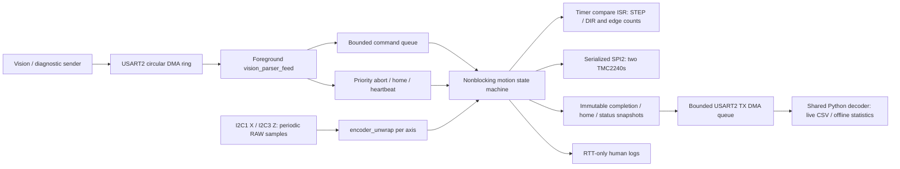

# Dual-axis motion diagnostics design

**Status:** implementation contract, not implemented firmware or hardware qualification. Worker B, 2026-10-06.

Sources: [datasheet notes](../hardware/diagnostics_datasheet_notes.md), [vision protocol](communication_protocol.md), [wiring](../hardware/wiring.md), [mechanics](../hardware/bom_and_mechanics.md), current `MotorControls\MotionFirmware\Core\Src\main.c`, and Worker A's research report received 2026-10-06. The VisionSystem remediation mandate was read. **Coordinator decision:** retain deployed Python command CRC coverage (preamble included); byte-preserving vision transport and nonblocking live diagnostic logging are user-approved implementation scope. This design-only deliverable changes no firmware or vision source.

## 1. Architecture and operating contract



| Concern | Decision |
| --- | --- |
| Execution model | Foreground cooperative state machine plus short ISRs; no new RTOS dependency for this diagnostic slice. Its queues/state machine can later become FreeRTOS tasks without changing frames or the existing pure-logic APIs. Current main is a single-Z bounce test, not the RTOS/DMA system described in protocol docs. |
| Existing Worker C interfaces | Use `crc16_ccitt(const uint8_t *, size_t)`, `vision_cmd_t` with `type/obj_id/class_id/x_01mm/y_01mm/angle_01deg/corr_01deg`, and `vision_parser_feed(...)` events `NONE/FRAME_OK/CRC_ERR/FORMAT_ERR` and counters. **Change parser coverage to bytes 0…13** without redesigning its API. Python command angle is wire `int16`; the existing `uint16` member retains the same valid 0…3599 bits, with negative/out-of-range wire values rejected. Use existing `encoder_unwrap.h` for independent 12-bit-to-`int32_t` accumulators. Worker C's exact-half-turn ties use +2048 with a sticky alias flag: acquisition must reject that update as evidence and require re-home, not interpret the tie convention as physical direction. |
| RX | 512-byte circular DMA buffer; HT/TC/IDLE interrupts publish producer progress only. Foreground drains into the parser frequently enough to avoid overwrite (512 bytes occupy 44.4 ms at full line rate); target service ≤2 ms. Track monotonic producer/consumer counts to detect a full lap, not just equal DMA indices. On overwrite increment counter, invalidate partial parse and resynchronize. |
| Queue / backpressure | Four pending pick commands, one active. Reserve a completion slot before admission; eight motion-sized TX slots suffice for five outstanding pick results with additional control-result reserve. At exhaustion reject new picks with identity-bearing rejection records if a slot is available; status exposes rejection counters otherwise. Never overwrite accepted-command evidence. Coalesce periodic status; preserve motion/home records. Suspend new motion on sustained TX failure, while continuing RX and stop handling. |
| Commands | Allocate monotonically increasing `command_seq` to each valid input frame, even repeated `obj_id`. Queue FIFO; test repetitions are permitted. Parser failures never move an axis. Heartbeat/abort bypass the pick queue. Re-home requires idle, empty queue, and explicit latch-clear policy below; otherwise report rejection. |
| State machine | `BOOT → HEALTH_CHECK → HOME_Z → HOME_X → READY → X_MOVE → X_SETTLE → Z_DOWN → Z_SETTLE → DWELL → Z_UP → Z_SETTLE → SNAPSHOT → READY`. Home Z upward first for clearance. Fault/abort states inhibit new STEP edges and invalidate position as appropriate. Bench mode has no vacuum/servo actuation. |
| Snapshot boundaries | Healthy, fresh stationary encoder and MSCNT samples before/after each phase; wait a configurable 10 ms endpoint settle after last STEP. Do not silently average endpoints or change filter profile. Zero-distance phases still take snapshots. Partial/failed phases retain actual observations and emitted counts; unstarted phases are explicitly invalid. |
| USART2 | **Binary records only** at 115200 8-N-1, TX DMA with buffer ownership until completion. Move banners, `log_printf`, and debug text to nonblocking RTT-only output (truncate safely). No ASCII RX fallback in this diagnostic build; document Python's actual optional ASCII formatter, but do not route it through the binary parser. Binary/text mixing would corrupt decoders and create unpredictable timing. One Python serial owner handles both commands and continuous diagnostic replies. |
| Safety boundary | UART `0x03` is a software abort, not a certified physical emergency stop. Independent physical power/interlock and Z anti-drop provision remain necessary. Never automatically disable Z torque under gravity without a brake/support. |

**Integration blockers confirmed by Worker A:** vision `4_detect_realtime.py:152` Latin-1-decodes the packet, then `utils\uart_handler.py:118` ASCII-encodes it; the first `0xAA` byte fails before transmission. **Chosen command CRC coverage is bytes 0…13, matching deployed Python, not the stale documentation/initial C parser's 2…13.** Golden command (ID=1, class=1, X=150 mm, Y=100 mm, angle/correction=0): `AA5501010001DC05E803000000009A740D0A` (CRC `0x749A`). Payload-only legacy C interpretation would compute `0x82BB` and reject it. Correct the firmware parser and protocol documentation, retain Python encoder/decoder coverage, and **do not silently accept both variants**. Replace vision's `readline`/ASCII reply path with the shared binary reader. User-approved implementation includes these vision repairs; Worker B still writes only this document.

Integration acceptance requires firmware and Python `encode_detection_packet`, `encode_heartbeat_packet` and packet decoder tests agreeing on preamble-inclusive CRC, with corruption/golden vectors for all firmware-supported types. Preserve deployed Python packet bytes; change the stale C coverage and docs rather than migrating Python to payload-only CRC. Until raw-byte transport and all endpoint tests pass together, integration remains **NON-INTEROPERABLE**; isolated parser success does not close it. Types 0x03/0x04 are firmware-accepted; production Python currently emits only 0x01/0x02, while the bench sender explicitly adds 0x03/0x04.

### STEP generation and evidence

Port reference-branch timer stepping and motion profiling: **TIM2 for Z, TIM5 for X**, retaining the branch's motor/timer ownership, with 1 MHz 32-bit timer deadlines for STEP rising/falling edges and DIR setup/hold. PC1/PC4 remain GPIOs: ISR writes GPIOC BSRR, not pin AF PWM requiring rewiring. Adapt `stepgen_irq_handler()` from the branch's double-edge/update scheme to this qualified **single-rising-edge** contract; use timer compare deadlines or an equivalent measured deterministic edge schedule. Schedule from the previous deadline, not ISR arrival. Only ISR owns pulse state and emitted counters. Sequential X, Z-down, Z-up avoids unnecessary coordinated interpolation; homing uses the same engine.

ISR work: clear compare flag, check abort latch, write edge, increment signed emitted microsteps and unsigned rising-edge count **only when actually writing a rising edge**, schedule the next edge. No HAL I2C/SPI/UART, formatting, allocation, or delay in ISR. Generate trapezoidal acceleration intervals in foreground with a bounded look-ahead buffer; starvation or excessive lateness stops rather than emitting catch-up bursts. A late falling edge must never be followed by a shortened low pulse. Timer has higher priority than UART/I2C callbacks; measure its worst interrupt latency with a logic analyzer.

Initial application settings: STEP high **5 µs**, DIR setup/hold **20 µs**, single-edge stepping (`DEDGE=0`), 1/16 microsteps (`MRES=4` by repository mapping), and 2,000 steps/s maximum per axis during bring-up (X 25 mm/s, Z 5 mm/s), starting at 500 steps/s. Minimum STEP-low time and lateness margin must be configured/qualified, not inferred. **These are conservative application choices, not verified TMC2240 electrical minima.** Official STEP/DIR limits are UNVERIFIED; do not increase rate or shorten dwell before obtaining the datasheet and bench qualification. ISR timing is less deterministic than direct hardware outputs, so exceeding the measured jitter budget is a release blocker; timer-triggered GPIO DMA is a later alternative.

Current DWT busy-wait pulses are interrupted by SPI reads and blocking UART logs, consume foreground time, and cannot enforce sample deadlines. DWT may remain an instrumentation clock, not the motion executor. Emitted count proves software edges, not driver acceptance or actual mechanical motion.

### Encoder acquisition

| Item | Contract |
| --- | --- |
| Bus / source | X: I2C1 PB8/PB9; Z: I2C3 PA8/PC9; separate devices at 7-bit `0x36`, both buses 400 kHz. Read RAW ANGLE high/low in one two-byte transaction, mask to 12 bits; do not unwrap scaled ANGLE. Thesis lines 3381–3383 assign the opposite buses; task/wiring mapping is authoritative for this build and must be verified physically, not swapped silently. |
| Profile | Volatile documented CONF fields `0x0300`: normal power, HYST off, SF 2×, FTH off, WD off. Preserve reserved bits, read back, allow ≥1 ms setting propagation and endpoint settling. Never write OTP register `0xFF` or change range to establish zero. |
| Cadence | **2 ms target per axis**; timestamp each accepted raw read, with conservative acquisition uncertainty. Separate raw polling from health snapshots (STATUS/AGC, nominal 20 ms and fresh at endpoints). Existing synchronous HAL port may be used in foreground with bounded timeout; an async port is optional, not a change to unwrap API. |
| Wire budget | RAW two-byte read ≈45 SCL clocks =112.5 µs per axis at 400 kHz, or ≥0.225 ms for both serialized, excluding overhead. Full existing `as5600_read_sample` has six transactions, ≈0.6075 ms/axis, 1.215 ms serialized for both; 100 kHz cannot sustain 2 ms full samples. No sensor calls in STEP ISR. |
| Datasheet timing | Internal sample period 150 µs typical; selected SF 2× response 0.286 ms, RMS noise 0.043°. Polling does not guarantee independent samples or atomic multi-register acquisition. Hardware high/low latching is UNVERIFIED. |
| Freshness / aliasing | Require MD=1, ML=MH=0; store health age. Reject stale/error outputs as new samples. Check **total possible angular travel** over actual accepted-sample gap: `f_step_max × gap_s < 1600`, with guard band ≤800 step-equivalents. Exact ±2048-count jump is ambiguous. Raw delta alone cannot detect an aliased whole turn. |
| Bring-up gap policy | At 2,000 steps/s, 10 ms gap means only 20 steps / 2.25°; latch sampler-overrun above 10 ms and controlled stop. At every later configured speed enforce the stricter travel/gap bound as well. Noise/measurement lag requires extra margin; commanded speed alone cannot bound manually forced rotation. |
| Continuity | NACK, magnet fault, incoherent sample, reset, overflow or ambiguous gap sets invalid flags; do not invent turns using commanded steps. Require re-home to re-establish an invalid reference. Worker C's `enc_unwrap_update` still accumulates flagged samples; the wrapper withholds them from valid records. Its `set_zero` preserves sticky flags/config and previous raw, so zero-setting alone is not recovery: explicitly reset/reinitialize tracking through the existing API after qualified recovery and seed a fresh healthy raw sample before capturing the new home origin. Monitor exposed `initialized`, `suspect_alias`, `overflow`, counters and `max_delta_counts`. RAW startup delay ≥10 ms. |

## 2. UART command mapping and bounds

Mechanical scale: 200 full steps/rev ×16 = **3200 external microsteps/rev**, step angle **0.1125°**; X 40 mm/rev →80 steps/mm; Z 8 mm/rev →400 steps/mm. Coordinate X increases away from its home end; Z is **positive downward**, with zero at the backed-off upper home. Calibrate electrical DIR, driver phase sign, and encoder sign separately.

| Input / operation | Action and recorded meaning |
| --- | --- |
| `0x01`, `POS_X_MM` | Absolute X target relative to software home, input signed `int16` in 0.1 mm. X moves only while Z is at safe height. |
| Pick Z | Configured `pick_depth_01mm` down to conveyor and `safe_z_01mm` back up; Z target is **not** POS_Y. Bring-up defaults: safe Z=0 and pick depth=0 (dry-run); require an explicitly qualified positive pick depth before a real down/up cycle. Depth constant per run, not encoded by the unchanged vision frame. |
| `POS_Y_MM`, ANGLE, CORR, CLASS | Echo exactly; Y is conveyor coordinate, not a Z coordinate. No conveyor timing prediction, suction, bin selection or servo control in this diagnostic slice. Validate angle 0…3599 and correction −1800…1800 and permitted classes; a vision client sending 3600 needs normalization on host. |
| `0x02` heartbeat | Immediate status snapshot with echoed identity, no motion or re-zero; optional periodic status 1 Hz. Heartbeats never clear a fault or home epoch. |
| `0x03` abort | Immediately latch stop; inhibit new rising edges, allow an already-high pulse to fall normally. Capture partial active command, mark queued commands cancelled and emit their terminal records. Keep safe holding policy; require operator review and explicit `0x04` after recovery. No automatic retry/resume. |
| `0x04` re-home | At idle and queue empty, clear an abort latch only after safe inputs/health are valid, home Z then X using StallGuard4, and emit a separate homing-result record. On failure remain unhomed/faulted; no picks accepted. Automatic boot homing has `command_seq=0`. |
| Soft travel | BOM nominal stroke X 300 mm / Z 150 mm is not calibrated usable stroke. Configure usable maxima after margins, screw/pulley sign, backlash, actual travel and home backoff are checked. Picks disabled until bounds are confirmed. Require both requested depth and safe Z within bounds and safe Z≤depth. Do not clamp a hazardous Z configuration; reject it. |
| Clamping | Default **reject** an out-of-range X target, not silently pick the wrong object. Optional explicit bench-only `clamp_x` limits to `[0, usable_x]`, flags CLAMPED, preserves original request and applied target separately. Report clamp displacement separately from quantisation. |

Fixed-point conversion: for a target `t` in 0.1 mm, `target_steps = round_away_from_zero(t × steps_per_mm / 10)`, using signed 64-bit intermediate and nearest rounding with exact halves away from zero. Round **absolute target once**, then subtract the integer starting position, avoiding cumulative relative-rounding drift. X gives exactly `8t`, Z exactly `40t`; thus no microstep residual for valid 0.1 mm lattice targets under these nominal scales. For calibrated noninteger scales use rational numerator/denominator and identical rounding on host.

`quant_residual_nm = target_steps × lead_nm / 3200 − applied_target_01mm × 100000`, rounded to nearest signed nm. Preserve request/applied targets and conversion scale; conversion or arithmetic overflow rejects execution. Rounding to 0.1 mm before UART is up to ±0.05 mm against the original continuous target, but **not** an extra error against the received target.

## 3. STM32 → PC wire protocol, version 1

All offsets below are decimal. Multibyte values are **little-endian**, signed integers are two's complement. Explicit field-by-field packing; **never transmit a native C struct**. Sensors' high-byte-first I2C words are converted before wire packing. Reserved bytes/bits zero. Length is payload bytes only; total frame length = `44 + payload_len`. CRC16-CCITT-FALSE (poly `0x1021`, init `0xFFFF`, nonreflected, xorout 0) covers bytes **2 through `39 + payload_len` inclusive**, including version, type, length and header. CRC is LE at `40+L..41+L`; CRLF is at `42+L..43+L`.

### Common 40-byte header

| Offset | Name | Type / value |
| --- | --- | --- |
| 0–1 | preamble | `D3 7E`, distinct from vision `AA 55` |
| 2 | version | `u8`, 1 |
| 3 | record_type | `u8`: `0x81` COMMAND_RESULT, `0x82` HOME_RESULT, `0x83` STATUS |
| 4–5 | payload_len | `u16`: 312 / 80 / 72 respectively |
| 6–9 | record_seq | `u32`, increments for every serialized record; gaps observable |
| 10–13 | timestamp_ms | `u32`, monotonic boot milliseconds at result commit; wraps, host extends |
| 14–17 | command_seq | `u32`, firmware valid-frame ordinal; 0 for boot/unsolicited status |
| 18–21 | home_epoch | `u32`, increment only after both axes successfully re-home |
| 22–25 | status_bits | `u32`, global outcome/errors below |
| 26–27 | obj_id | `u16`, exact input echo, 0 when unsolicited |
| 28 | class_id | `u8`, exact input echo |
| 29 | command_type | `u8`, exact input echo, 0 when unsolicited |
| 30–31 | rx_x_01mm | `i16`, exact received X |
| 32–33 | rx_y_01mm | `i16`, exact received Y |
| 34–35 | rx_angle_01deg | `u16`, exact received orientation |
| 36–37 | rx_corr_01deg | `i16`, exact received correction |
| 38 | phase_count | `u8`, number of phases begun (0…3); 0 in home/status |
| 39 | config_id | `u8`, immutable run configuration identifier, 1 for nominal bench profile |

`config_id` refers to host run metadata: firmware revision, leads, full-step angle, microsteps, signs, limits, speeds, acceleration, pulse timing, SG settings, settle/dwell, encoder CONF and clamp policy. Host must reject unknown/mismatched configuration for quantitative analysis; changing any configuration starts a new run/config ID, not a silent scale change.

Global status bits: 0 SUCCESS, 1 ABORTED, 2 CANCELLED, 3 REJECTED, 4 CLAMPED, 5 NOT_HOMED, 6 DRIVER_FAULT, 7 ENCODER_INVALID, 8 SAMPLE_OVERRUN, 9 STEP_TIMING_FAULT, 10 MSCNT_MISMATCH, 11 MSCNT_UNQUALIFIED, 12 RX_OVERFLOW, 13 TX_BACKPRESSURE, 14 HOME_FAILED, 15 LIMIT_FAULT, 16 CONFIG_INVALID, 17 POSITION_UNCERTAIN; 18…31 reserved. SUCCESS excludes aborted/rejected/faulted outcomes; CLAMPED and MSCNT_UNQUALIFIED may accompany completion but are not acceptance evidence.

| Classification | Exact bits | Readiness semantics |
| --- | --- | --- |
| **FAULT / readiness-blocking condition** | **1** ABORTED, **5** NOT_HOMED, **6** DRIVER_FAULT, **7** ENCODER_INVALID, **8** SAMPLE_OVERRUN, **9** STEP_TIMING_FAULT, **10** MSCNT_MISMATCH, **13** TX_BACKPRESSURE, **14** HOME_FAILED, **15** LIMIT_FAULT, **16** CONFIG_INVALID, **17** POSITION_UNCERTAIN | A host considers STATUS ready only when both axes are homed and none of these bits is set (mask **`0x0003E7E2`**). Latched position/health faults require qualified recovery/re-home; bit 13 is an active transport/backpressure condition and can clear when transport recovers. Rejected-command outcome bits in a COMMAND_RESULT do not by themselves change the later STATUS readiness. |
| **INFORMATIONAL / command outcome** | **0** SUCCESS, **2** CANCELLED, **3** REJECTED, **4** CLAMPED, **11** MSCNT_UNQUALIFIED | Do not block STATUS readiness. These do affect the eligibility of individual measurement records; unqualified MSCNT is never proof of accepted pulses. |
| **EVENT** | **12** RX_OVERFLOW | Set in a STATUS only if an RX overwrite/UART-restart loss, CRC error or format error occurred since the previous successfully committed STATUS. Clear on the following STATUS if no new event occurred; cumulative counter fields remain cumulative. An event-bearing queued STATUS is not coalesced away. If queue admission fails, the event remains pending for a later STATUS. This bit never latches a motion fault or blocks explicit re-home. |
| **Reserved** | **18…31** | Zero in v1; unknown bits require host protocol/configuration review, not reinterpretation as existing faults. |

### COMMAND_RESULT: three 104-byte phase blocks, **356 bytes total**

One record per executed pick command, including partial abort, plus terminal rejected/cancelled pick records when reportable. Fixed blocks: **X_MOVE at byte 40**, **Z_DOWN at 144**, **Z_UP at 248**. Capture Z descent **and** return: a single net-Z delta would hide missed steps on an out-and-back move. Planned targets remain present in unstarted blocks; measurement fields are zero with validity bits clear. CRC at 352–353, CRLF at 354–355.

| Relative offset (add block base) | Field | Type / units |
| --- | --- | --- |
| 0 | axis | `u8`, 0=X/motor1, 1=Z/motor0 |
| 1 | phase | `u8`, 1=X_MOVE, 2=Z_DOWN, 3=Z_UP |
| 2–3 | axis_flags | `u16`, below |
| 4–7 | requested_target_01mm | `i32`, absolute target (X input / Z configuration) |
| 8–11 | applied_target_01mm | `i32`, bounded accepted target |
| 12–15 | start_position_steps | `i32`, software emitted position relative to home |
| 16–19 | target_position_steps | `i32`, planned absolute target |
| 20–23 | commanded_delta_steps | `i32`, target − start, frozen when phase begins |
| 24–27 | emitted_delta_steps | `i32`, signed actual rising-edge count, axis-positive sign |
| 28–31 | emitted_edge_count | `u32`, unsigned rising edges (no direction cancellation) |
| 32–35 | step_angle_udeg | `u32`, nominal 112500 µdegrees/microstep |
| 36–39 | quant_residual_nm | `i32`, step target − applied target, not clamp error |
| 40–41 / 42–43 | mscnt_start / mscnt_end | `u16`, 10-bit phase snapshots |
| 44–45 / 46–47 | mscnt_expected / mscnt_observed | `u16`, modulo-1024 delta |
| 48 | mscnt_check | `u8`, 0=unavailable, 1=pass, 2=fail, 3=unqualified |
| 49 | driver_mode | `u8`: bits 0…3 MRES, 4 INTPOL, 5 DEDGE, 6 SHAFT, 7 reserved |
| 50–51 / 52–53 | raw_start / raw_end | `u16`, 12-bit AS5600 RAW |
| 54 / 55 | as_status_start / as_status_end | `u8`, raw STATUS |
| 56 / 57 | agc_start / agc_end | `u8`, raw AGC |
| 58–59 | as_conf | `u16`, actual full CONF readback (reserved bits preserved); latest endpoint/health observation, not a profile constant |
| 60–63 / 64–67 | unwrap_start / unwrap_end | `i32`, native sensor-sign multi-turn counts |
| 68–71 | unwrap_delta | `i32`, unwrap_end − unwrap_start |
| 72–75 | shaft_delta_001deg | `i32`, axis-sign angle, **0.01°** (name avoids command's 0.1°) |
| 76–79 | displacement_um | `i32`, axis-sign encoder displacement, µm |
| 80–83 | home_offset_counts | `i32`, native unwrapped-count origin captured at settled home |
| 84–87 | move_duration_us | `u32`, DIR setup start to final falling edge; excludes endpoint settle/dwell |
| 88–91 | max_sample_gap_us | `u32`, largest accepted-RAW gap over this phase and settling |
| 92–95 / 96–99 | raw_start_timestamp_us / raw_end_timestamp_us | `u32`, boot µs at acquisition, modulo wrap |
| 100–101 / 102–103 | health_start_age_ms / health_end_age_ms | `u16`, age of health snapshot at RAW acquisition, saturated |

CONF is read at boot and at each health/endpoint acquisition. Compare documented
bits `CONF & 0x3FFF` with `0x0300`, retaining the full word on the wire. A mismatch
invalidates encoder evidence and sets FAULT bits **7 ENCODER_INVALID** and
**16 CONFIG_INVALID**; recovery requires a matching observed profile plus qualified
reseed/re-home, not silently overwriting the measured CONF with the desired value.

Axis flags: 0 PHASE_BEGUN, 1 PHASE_COMPLETE, 2 START_ENCODER_VALID, 3 END_ENCODER_VALID, 4 UNWRAP_CONTINUOUS, 5 HOME_VALID, 6 START_MSCNT_VALID, 7 END_MSCNT_VALID, 8 CLAMPED, 9 SAMPLE_OVERRUN, 10 MAGNET_FAULT, 11 I2C_ERROR, 12 ENCODER_SIGN_NEGATIVE, 13 MSCNT_AXIS_SIGN_NEGATIVE, 14 CONVERSION_OVERFLOW, 15 reserved. Validity flags, not zero values, distinguish real zero readings from missing data.

Candidate MSCNT model: `expected = (phase_sign × emitted_delta_steps × 16) mod 1024`, `observed = (end − start) mod 1024`, with calibrated phase sign, fixed MRES=4 and DEDGE=0. Use existing `tmc2240_get_microstep_counter`, not a duplicate getter. **Model remains UNVERIFIED against official TMC2240 documentation.** Diagnostic qualification should disable interpolation (`INTPOL=0`), verify readback, then test stationary short moves in both directions. Current main enables INTPOL; arbitrary interpolated reads are not comparable. Mark check=3 until qualified, never PASS by assumption. Reset/mode changes invalidate baseline. Phase agrees every 64 steps at this setting: it cannot prove full displacement or detect shaft slip.

For this firmware's enforced **SHAFT=0**, `phase_sign` in that formula is
**derived from the actually driven DIR polarity (`dir_sign`)**, not an independently
editable configuration value. Thus nominal X has +1 and Z has −1; axis flag
**13** reports this negative MSCNT/axis mapping. The simulator advances MSCNT
from DIR pin level at each rising STEP edge, independently of software position.

### HOME_RESULT: two 40-byte blocks, **124 bytes total**

Payload starts at 40, X block at 40 and Z at 80 (execution order may be Z then X). Emit on boot and each `0x04` completion/failure. CRC 120–121, CRLF 122–123.

| Relative offset | Field | Type / units |
| --- | --- | --- |
| 0 / 1 / 2 / 3 | axis / result / reserved / sg_threshold | `u8` each; result 0=not run, 1=success, 2=timeout, 3=travel exhausted, 4=abort, 5=health/driver fault |
| 4–7 | seek_emitted_steps | `i32`, signed coarse approach |
| 8–11 | backoff_steps | `u32`, actual pulse count |
| 12–15 | latch_emitted_steps | `i32`, signed repeat approach |
| 16–17 / 18–19 | sg_baseline / sg_trigger | `u16`, load evidence |
| 20–21 / 22–23 | mscnt_zero / raw_zero | `u16`, settled reference snapshots |
| 24–27 | home_offset_counts | `i32`, native unwrapped reference |
| 28–31 | home_emitted_origin_steps | `i32`, emitted-counter reference before software position reset |
| 32–35 | home_duration_us | `u32` |
| 36–37 | axis_flags | `u16`, same relevant validity/sign flags |
| 38 / 39 | as_status / agc | `u8`, health at reference |

Home uses bounded coarse approach, backoff, repeat approach at a qualified **StallGuard4 operating speed**, then fixed clearance/backoff and settle before zero capture. Do not assume an arbitrarily slow latch is valid for SG4. Do not measure the entire stroke by repeatedly crashing into both ends. Timeout/travel budgets, low-count confirmation, driver faults, physical abort and Z holding policy apply throughout. Worker A confirmed reusable `axis_ctrl_home()` / `axis_ctrl_step()` states on `origin/feature/stepper-stallguard-homing`; selectively adapt them, omitting automatic opposite-end stroke probing for this slice. Parameters still require bench calibration; do not copy current 250 mm maximum-Z leg into a nominal 150 mm mechanism.

### STATUS: 72-byte payload, **116 bytes total**

Periodic 1 Hz, immediate `0x02`, and on faults/rejections; pending unsolicited snapshots may be coalesced. CRC 112–113, CRLF 114–115.

| Absolute offset | Field | Type |
| --- | --- | --- |
| 40 / 41 / 42 / 43 | state / command_queue_depth / tx_queue_depth / homed_mask | `u8`; state 0=boot, 1=homing, 2=ready, 3=moving, 4=aborted, 5=fault; mask bit0 X/bit1 Z |
| 44–47 / 48–51 / 52–55 | rx_crc_errors / rx_format_errors / rx_overflows | `u32` counters |
| 56–59 / 60–63 | rejected_commands / tx_record_drops | `u32` counters; accepted terminal-result drops must remain zero |
| 64–67 / 68–71 | x_drv_status / z_drv_status | `u32`, raw TMC DRV_STATUS snapshot |
| 72–75 / 76–79 | x_position_steps / z_position_steps | `i32`, software emitted position |
| 80–83 / 84–87 | x_unwrap_counts / z_unwrap_counts | `i32`, last accepted sensor counts |
| 88–91 / 92–95 | x_max_sample_gap_us / z_max_sample_gap_us | `u32`, maximum since last status |
| 96 / 97 / 98 / 99 | x_as_status / z_as_status / x_agc / z_agc | `u8` |
| 100–103 / 104–107 | x_home_offset_counts / z_home_offset_counts | `i32` |
| 108–109 / 110–111 | x_health_age_ms / z_health_age_ms | `u16`, saturated; 65535=unavailable/stale |

Status data can be cached; READY/homed and global ENCODER_INVALID/POSITION_UNCERTAIN govern whether positions are usable. Data ages expose stale health; fault snapshots must not be passed off as current valid reads.

### Transmission budget

| Record | Bytes | Minimum wire time at 115200, 10 bits/byte |
| --- | --- | --- |
| Command (3 phases) | **356** | **30.90 ms** |
| Homing (both axes) | **124** | **10.76 ms** |
| Status | **116** | **10.07 ms** |

Wire capacity 11,520 bytes/s. Ten picks/s plus 1 Hz status uses 3,676 bytes/s (**31.9%**) before rare home/fault events; ideal ceiling ≈32 picks/s with status is not an operating target. USB/VCOM/host stalls require queue margin. TX DMA permits sampling/motion during transmission; backpressure stops further command admission, never the endpoint measurement of the active command. Timestamp µs wraps after 71.6 minutes; host handles modular differences only within bounded phase duration (<2³¹ µs), and splits runs on reset.

## 4. Measurement definitions (each axis, each phase)

Let `L` be lead in µm/rev (X 40000, Z 8000), `s0` the software start position, `n` emitted signed microsteps, `d` native unwrapped-count delta, `h` home offset, and `e_sign` encoder axis sign.

| Quantity | Definition |
| --- | --- |
| Requested displacement `C_req` | `requested_target_01mm ×100 − s0 × L/3200` µm |
| Applied displacement `C` | `applied_target_01mm ×100 − s0 × L/3200` µm |
| Planned step displacement | `commanded_delta_steps × L/3200` |
| Step-implied displacement `S` | `n × L/3200` |
| Measured shaft angle | `e_sign × d ×360/4096` degrees; wire rounds once to 0.01° |
| Encoder displacement `E` | `e_sign × d × L/4096`; wire rounds once to µm |
| Quantisation / command execution error | `S − C`; normally lattice quantisation, but includes incomplete execution on abort. Clamp adds `C − C_req` when comparing received request. |
| Shaft tracking / mechanical error | `E − S`: missed mechanical motion, microstep nonlinearity, encoder error, etc.; not uniquely identifiable as “lost steps”. |
| Total displacement error | `E − C`; received-request version `E − C_req`. Identity: `(S−C)+(E−S)=E−C`. |
| Absolute measured endpoint | `e_sign × (unwrap_end − h) × L/4096`, compared against absolute requested/applied target |

Host recomputes using raw counts and integer steps, not rounded telemetry angle/displacement. Keep **endpoint error** distinct from **move-delta error**: accumulated starting-position error can otherwise cancel. Z-down pose and Z-up safe pose are analyzed separately; net round-trip cancellation is not acceptable evidence.

**Observability limit:** AS5600 is mounted on the motor shaft, not the carriage/tool. These are shaft-equivalent linear estimates, not proof of Cartesian accuracy. Belt stretch, belt/pulley slip, screw backlash, coupler slip downstream of the sensor, lead error, compliance and tool deflection require an external calibrated linear reference. Homing repeatability contributes to absolute error; re-zeroing each trial can hide it.

## 5. Python host analyzer (`uv`)

Standalone CLI location: `MotorControls\MotionFirmware\tools\diag\`, close to firmware/wire tests. **Shared importable library:** repository-root `packages\motion_diagnostics\`, with `pyproject.toml` and `src\motion_diagnostics\`. Both the CLI and vision import `motion_diagnostics.frames`, `motion_diagnostics.csv_io`, etc. Install the shared package normally/editably into the vision environment using `uv pip install -e packages\motion_diagnostics` from repository root; register it as a local path dependency/uv source in the CLI's `pyproject.toml`. Persist the vision installation/dependency setup in its existing environment instructions/manifest. No `sys.path` edits, ad-hoc file imports or duplicate decoders. CLI has a console entry, pyserial runtime dependency and pytest test dependency; shared framing/metrics code needs only the standard library. Use one serial-port owner: vision and bench sender cannot simultaneously open VCOM.

Metrology references verified by Worker A: JCGM/BIPM VIM [accuracy](https://jcgm.bipm.org/vim/en/2.13.html), [trueness](https://jcgm.bipm.org/vim/en/2.14.html), [precision](https://jcgm.bipm.org/vim/en/2.15.html); public scopes of [ISO 5725-1](https://www.iso.org/standard/69418.html) and [ISO 9283:1998](https://www.iso.org/standard/22244.html). Public identification is not access to normative equations. [RoboDK's ISO-style validation guide](https://robodk.com/doc/en/Robot-Validation-ISO9283.html) corroborates five poses/30 repetitions but does not replace the licensed standard.

| Proposed module | Responsibility |
| --- | --- |
| CLI `diag\__main__.py`, `cli.py`, `serial_io.py` | `capture`, `sequence`, `analyze`; port/config/timeouts and serial lifecycle; import shared modules rather than reimplement frames/stats |
| Shared `src\motion_diagnostics\frames.py`, `crc.py` | Incremental byte-stream decoder, exact v1 lengths and LE decode, resync/CRC, CCITT-FALSE known vector; bound length ≤312 and supported types before allocation |
| Shared `commands.py` | Exact 18-byte vision framing fixtures/sender helper, CRC over **0…13**; heartbeat/abort/re-home/pick generation; regression equality with production `uart_protocol.py` |
| Shared `csv_io.py`, `metrics.py`, `correlation.py` | Union CSV schema, per-phase/pose errors and statistics; session/send-sequence registry, reply matching and unmatched/ambiguous handling |
| Vision `utils\diag_receiver.py` | Background receive/decode pump using shared decoder and correlation registry; buffered CSV writer, shutdown/health/backpressure reporting |
| Shared/CLI/vision `tests\` | One decoder/golden-vector set reused by both consumers; metric/CLI tests and mocked nonblocking live-runtime integration |

Decoder scans for D3 7E, validates version/type/length/CRC/CRLF, then emits a record. On invalid candidate advance one byte and rescan buffered data; preamble/CRLF inside payload are legal. Record reset/sequence gaps, parser counters and missing completions; never decode by `readline`. Capture also saves raw binary and run metadata (firmware revision/config, trial list, timestamp, scale/sign calibration). Files live at caller-specified project paths, not network shares or temporary directories. Host allocates a new `run_id` on connect/reset, starts a fresh capture segment, and performs an identity-matched heartbeat/re-home handshake before scored trials. Never join solely by 16-bit `obj_id`: use run ID plus firmware command ordinal; resets/regressing ordinals or timestamps invalidate outstanding joins.

**CSV:** one row per decoded record, union schema with blanks for inapplicable values. Header columns:
`record_type,version,record_seq,timestamp_ms,host_receive_utc,command_seq,home_epoch,status_bits,obj_id,class_id,command_type,rx_x_01mm,rx_y_01mm,rx_angle_01deg,rx_corr_01deg,phase_count,config_id,session_id,host_send_seq,host_send_utc,match_status`.
For each prefix **`x_move_`, `z_down_`, `z_up_`**, append every field name in the 104-byte block table (including validity flags and timestamps), then derived:
`commanded_um,requested_um,step_implied_um,encoder_um,clamp_error_um,quant_command_error_um,shaft_tracking_error_um,total_error_um,requested_total_error_um,endpoint_um,endpoint_error_um,requested_endpoint_error_um,step_implied_deg,shaft_error_deg,metrics_eligible,exclusion_reason`.
Home columns are `home_x_` / `home_z_` plus each home-block field; status columns use the status-table names. Host-only `run_id,trial_id,pose_id,repeat_index` join using `(run_id,command_seq)` and the echoed fresh test `obj_id`; unsolicited rows leave trial columns blank. CSV stores numeric flags, not just translated prose. Unknown/missing samples remain blank, never zero-filled derived data.

| Statistic / grouping | Definition |
| --- | --- |
| Groups | Axis + phase + applied pose + approach direction + config + home epoch; retain requested pose and clamped group separately. Do not pool Z-down with Z-up or moving samples with settled endpoints. Cross-epoch homing repeatability is a separate report. |
| Count / quality | Received count, eligible count, rejected/aborted/clamped/invalid/missing counts; compare terminal results to sent trial count. Exclude invalid references, aborts, unqualified scales/signs and clamp events from nominal acceptance metrics, but report them. |
| Accuracy / error summaries | Mean signed endpoint error (bias), `AP_1D=|bias|`, MAE, RMSE and maximum absolute endpoint error, and the same metrics for phase total/tracking error; axis units µm. VIM treats accuracy as a qualitative concept; label numeric outputs as position-error/AP summaries rather than an invented “accuracy %”. Shaft-equivalent results are not ISO certification. |
| Precision / thesis repeatability | Sample standard deviation of endpoint error, denominator `N−1`, unavailable for N<2 (never zero). ISO-style RP is likewise unavailable for N<2; count/individual errors remain reportable. Independent comparable trials, not sensor samples. |
| ISO-style repeatability | For scalar endpoint positions `p_i`, center `p̄`, set `l_i=|p_i−p̄|`, `l̄=mean(l_i)`, `S_l=sqrt(sum((l_i−l̄)²)/(N−1))`, `RP=l̄+3S_l`. For actual Cartesian vector positions, use Euclidean distances instead and `AP=||p̄−p_command||`; shaft X/Z values alone do not establish tool pose RP. Worker A corroborated the engineering formulation, but normative equations/geometry remain pending licensed ISO 9283 text. Label scalar result “ISO-style 1D analogue”, not certified ISO RP. ISO 5725 trueness/precision terminology is not interchangeable with robot AP/RP. |
| Angular | Signed unwrapped shaft error `e_sign×d×360/4096 − n×360/3200`: mean, max absolute, sample std and count in degrees; also report `±3s` as an explicitly labeled angular spread. No circular wrap of multi-turn displacement. Absolute single-turn orientations, if reported, need circular statistics, never ordinary mean across 359°/1°. Formal ISO orientation conventions remain pending licensed text. |

Test sender: accept **M X target poses**, repeat **N** times (default N=30), fixed explicitly configured Z depth/safe pose, heartbeat until boot homing succeeds, send one pick and await its matching terminal result before the next. Fresh `obj_id` per trial; no artificial vision deduplication. Absolute positioning comparisons use returned home offsets. Preposition to a fixed lower X approach coordinate with its own non-scored command before each scored trial, including repeated identical targets; otherwise repeated same-pose zero-length moves do not test positioning. Provide separate reversal trials and cross-rehome trials. Host timeout sends software abort, never automatic command retry. No response means uncertain execution.

Worker A located thesis requirements at lines 3510–3519: ≥30 trials, different approach directions/home starts, external dial indicator or laser, mean deviation and standard deviation. Publish both thesis SD and the distinct ISO-style radius RP, and separate merely returning to home from re-homing each trial. A five-pose planar center/corner adaptation may be added with separately qualified Z configurations; the unchanged command format has no per-command Z target, so the fixed-depth X sweep alone is **not** the full ISO pose sequence. Preserve speed/load/temperature/approach metadata. The extracted thesis numerical acceptance criterion is garbled; do not infer a tolerance. Repository `Dokumentasi_Testing\README.md` reportedly uses ±0.2 mm, which needs user confirmation and must not be presented as a recovered thesis criterion.

### User-approved live vision integration

1. `utils\uart_handler.py`: provide a bytes-accepting command enqueue/write interface and pass exactly the original 18 bytes to pyserial. `4_detect_realtime.py` passes the encoded `bytes` directly; remove Latin-1 decoding, ASCII recoding and synchronous opportunistic ACK reads. Preserve optional ASCII debugging only as a separate explicit mode, never the binary live path.
2. The serial handler owns the port and starts `utils\diag_receiver.py` on connection. A background reader uses bounded reads and the **shared length-delimited decoder**, never `readline`. Detection does not read serial or wait for motion completion. A bounded writer queue/thread isolates serial write timeout/backpressure from detection; record admission failures explicitly rather than marking an unsent object successfully transmitted.
3. Before enqueueing each command, allocate host `session_id` (UUID per connection/run) and monotonic `host_send_seq`, register `obj_id`, command type/full echoed payload, expected approach direction and host times under a lock. Writer marks actual send success/failure. Reader attaches replies to this registry and logs the host identity plus firmware `command_seq`. A reply may race writer completion, so registry exists **before** write; keep unmatched replies until send state resolves within a bounded interval.
4. **The unchanged 18-byte command carries no host session/send-sequence fields.** Matching is host-side association, not a claim they are echoed by firmware. Permit at most one outstanding pick per `obj_id` within a session; require command type and exact echoed fields to match. Reuse/wrap of an ID is blocked while pending. Duplicate/replayed/ambiguous replies get `match_status` and no invented association. Heartbeat replies can establish a firmware ordinal anchor, but do not infer successful transmission/admission merely from send order. Missing/CRC-rejected commands do not silently shift joins.
5. CSV disk writes run off the detection thread, through a bounded logging queue. Raw/CSV logging preserves record validity and unmatched records, with counters for queue overflow/decoder errors/missing completions. On sustained reader/writer/logging failure disable new pick transmission and expose a runtime fault without blocking inference; do not silently discard accepted-command evidence. Flush/join with bounded timeout on shutdown and terminate the owned threads cleanly.
6. Reconnect/reset creates a new host session, clears pending joins as interrupted/unknown, and requires heartbeat/home readiness before new picks. Never retry uncertain commands automatically. Live records may lack a bench `pose_id`; derive pose groups from applied target and retain explicit direction metadata. Offline CLI analyzes the **same CSV schema and shared metric module**.

Acceptance: mocked serial asserts byte-for-byte equality with the deployed encoder, background-reader fragmentation/CRC/resync correctness, ID-wrap/duplicate/racing-reply handling, thread shutdown, bounded disk/serial stalls, and that artificial slow I/O does not block the detection loop.

Examples (proposed CLI, run from firmware root):

```powershell
uv run --project tools\diag python -m diag capture --port COM9 --csv results\capture.csv --config results\run_config.json
uv run --project tools\diag python -m diag sequence --port COM9 --targets-mm 25,100,200 --approach-mm 5 --repetitions 30 --csv results\trial.csv --config results\run_config.json
uv run --project tools\diag python -m diag analyze --csv results\trial.csv --config results\run_config.json
```

COM9 is an example, not hardcoded. Offline analysis never needs serial/hardware. Worker A confirmed conveyor Y is not Z, Python angle encoding is signed but wire-compatible within 0…3599, and rounding near 359.99° may produce 3600; normalize after quantization on the host. Vision dependency verification is currently blocked by missing numpy/OpenCV in the surveyed environment.

## 6. Theoretical error budget, not acceptance guarantees

Values below follow the verified AS5600 notes; linear units µm. Lattice rounding and noise are not automatically independent random contributions.

| Source | Shaft / reference | X equivalent | Z equivalent |
| --- | --- | --- | --- |
| Nominal external microstep | 0.1125° | 12.5 µm/step | 2.5 µm/step |
| Nearest-step quantisation bound | ±0.05625° | ±6.25 | ±1.25 |
| Actual 0.1 mm target lattice, nominal scales | X 8 / Z 40 microsteps per command unit | **0** step rounding residual | **0** step rounding residual |
| UART target rounding from continuous source | ±0.05 mm, absent against received target | ±50 | ±50 |
| AS5600 count resolution | 0.087890625° | 9.765625/count | 1.953125/count |
| Single rounded endpoint bound | ±0.5 count | ±4.882813 | ±0.976563 |
| Two-endpoint delta bound | ±1 count | ±9.765625 | ±1.953125 |
| Single-read uniform quantisation RMS model | count/√12, model only | 2.8191 | 0.5638 |
| Stated INL, best line fit / ideal installation | ±1°, not system guarantee | ±111.111 | ±22.222 |
| Worst endpoint INL difference | ±2° conservative | ±222.222 | ±44.444 |
| SF 2× output noise, stated RMS max | 0.043° per endpoint | 4.7778 | 0.9556 |
| SF 16× optional low-noise profile | 0.015°, settle 2.2 ms; new config/run | 1.6667 | 0.3333 |
| Wire output rounding | ±0.005° and ±0.5 µm | host uses counts instead | host uses counts instead |
| Home/shaft mechanics/installation | Not yet measured; microstep motion is not guaranteed nominal | Unknown | Unknown |
| Carriage backlash, elasticity, lead calibration | Not observable with shaft sensors | Unknown | Unknown |

Two independent SF 2× endpoint noise samples give approximate delta RMS 6.76 µm X /1.35 µm Z; independence is unproven, and do not double-count quantisation already present in measured sensor noise. A fixed healthy fixture may achieve repeatability in the several-µm X /≈1–2 µm Z shaft-equivalent range, **to be established experimentally**, not guaranteed. Uncalibrated differential INL alone permits ≈0.22 mm X /0.044 mm Z error plus quantisation/home/mechanical effects. Accuracy significantly tighter than that needs installed-system calibration and an external linear reference. No thesis acceptance threshold is invented here.

## 7. Verification and bench plan

| Tier | Required checks |
| --- | --- |
| Pure C host tests | Existing CRC/parser/unwrap API tests; `"123456789" → 0x29B1`; golden input command CRC **0…13 →0x749A**, rejection of former payload-only variant; corruption/truncation/concatenation/noise and frame overlap resync; all message types and range rejection; forward/reverse wrap, ±2048 ambiguity, invalid-gap wrapper, signed overflow. Rational mm↔steps round-trip at limits/half ties, exact X `8t`/Z `40t`, negative targets and clamp residuals. |
| Record packing | Byte-offset and exact-length fixtures for all three types; signed extrema/endianness, valid zero versus missing data, CRC coverage changes including header/length, three Z/X phase identities, abort/cancel records, timer wrap, no native struct-padding dependence. |
| Python | Same fixtures decoded in chunks of every boundary; false preambles within payload, corrupt length/CRC/tail, unknown version, reconnect/reset. Known bias/std/RP vectors: positions `[0,1,2]`, target 1 → bias 0, max error 1, sample std 1; radii `[1,0,1]` → RP `2/3 + 3/√3`. N=0/1 handling, grouping, clamp/fault exclusion, absolute-vs-delta distinction and multi-turn angular errors. |
| Cross-language | C emits fixture bytes into the test harness; Python validates response CRC/offsets and re-encodes byte-identically. Deployed Python detection/heartbeat encoders feed the C command parser with CRC over 0…13; types 03/04 bench frames follow the same rule. Command and response CRC coverage are distinct explicit contracts. Both languages implement CRC independently; vision and CLI share one Python response decoder. |
| Firmware build | Worker A's **unchanged baseline** Debug build passed via a short local subst path (FLASH 30,940 bytes, RAM 9,592 bytes); driver host tests 13+3 passed. Worker C reports phase-1 CRC/parser/unwrap/units host tests **4/4 passing with ASan/UBSan**, and all four modules compile for ARM. Worker C must still rebuild the integrated CMake/Ninja Debug firmware, verify ELF/map and no unresolved DMA/TIM/I2C HAL symbols; run smallest host C tests + `uv run --project tools\diag pytest`. Passing baseline/pure-logic tests is not validation of the future integrated executor or hardware qualification. |
| Integration stress | Feed serial at full line rate with CRC errors/queue-full while STEP and sampling operate; TX stalled, I2C timeout, SPI fault, abort during high pulse and each state. Verify no catch-up pulses, accepted-record loss or stale accepted samples; all counts/flags observable. |

Bench procedure, after wiring and user safety checks:

1. Mechanically support Z, isolate actuator/vacuum power, confirm physical stop, grounds and encoder magnet/supply installation. Identify the actual VCOM/J-Link interface; do not assume a converted debug probe still provides ST-Link VCOM.
2. Build/flash with configured J-Link/probe-rs tooling and start `capture`; RTT is the separate human channel. Verify both TMC connections, MRES/mode readbacks, encoder MD/ML/MH/AGC and CONF. Verify DIR/encoder/phase signs with safe short moves before any automatic endstop approach.
3. Scope PC1/PC4 and DIR/ENN under worst sampling/serial load. Measure STEP high/low, DIR setup/hold, jitter, counts and abort latency against the **obtained** TMC2240 timing table. Confirm status faults inhibit motion.
4. Qualify each SG4 home with bounded travel, appropriate speed/current, backoff and repeat latch. Start with low-energy manually supervised tests and safe Z clearance; capture HOME_RESULT and verify software-only offsets. Run repeated homing to quantify origin variation. Enable usable strokes/depth only after verification.
5. With interpolation disabled and qualified phase semantics, test ±1, ±2, ±10 and modulo-alias ±64 microsteps; compare MSCNT and encoder evidence. Deliberate encoder fault/turn-gap tests invalidate rather than synthesize feedback. Repeat with intended production interpolation profile, reporting unqualified comparison until validated.
6. Run sender N=30 / M≥3 safe target poses using a fixed approach, then bidirectional and cross-rehome trials. Retain X, Z-down and Z-up separately. CSV/analyzer must match sent/received counts and reject bad flags.
7. Compare shaft-derived displacement with calibrated dial indicator/linear scale at the carriage; report backlash/lead/belt error separately. Choose acceptance tolerances with the user based on task and reference uncertainty.
8. Exercise UART software abort and physical stop safely; prove no new pulses, no unsafe Z drop/restart, and re-home required when position is uncertain. Disconnect serial/encoder and fill queues; verify explicit faults and recoverability. Preserve raw/CSV/config/results for review.

## 8. Ordered Worker C implementation breakdown

Paths below are relative to `MotorControls\MotionFirmware\` unless prefixed **repo-root**. Port selectively from `origin/feature/stepper-stallguard-homing` (Worker A surveyed commit `b8bcd86d99a8c841903727a0fcf31056d4622d9b`); do not merge all 58 changed files blindly. No implementation files are changed by this design.

| Order | Files | Responsibility / generation constraint |
| --- | --- | --- |
| 1 | Existing `App\crc16_ccitt.{h,c}`, `vision_frame.{h,c}`, `encoder_unwrap.{h,c}` and `Tests\` | Keep pure APIs; change `vision_parser_feed` CRC input to the first 14 command bytes, update golden/corruption tests and retain semantic checks for types 1…4. Acquisition wrapper rejects sticky alias/overflow. |
| 2 | `App\motion_config.{h,c}`, existing units module; port `App\Inc\app_config.h`, `App\Src\app_config.c` selectively | Retain reference motor0/Z/TIM2/I2C3 and motor1/X/TIM5/I2C1 mapping, Z-before-X order and 400/80 steps/mm. Replace `APP_AUTOSTART=0` with controlled boot-home lifecycle, not automatic cycling. Rational units/signs/limits, safe defaults, rounding/overflow checks; no magic production depth. |
| 3 | `App\diag_record.{h,c}`, `tests\test_diag_record.c` | Explicit LE packer and all v1 record fixtures; snapshot validity, header/phase/CRC contract. |
| 4 | Port `App\Src\console.c`, `App\Inc\console.h`; add `App\uart_transport.{h,c}` adapter | Reuse `console_init/write/getc/poll/dropped_bytes`, UART error recovery, circular RX and TX DMA. Remove RTT-input merging and ASCII tokenization; only parser sees RX bytes. Preserve whole-frame TX ownership, completion reserve, ring overflow counters and backpressure; no raw human logs on USART2. |
| 5 | Port `App\Src\motion_profile.c`, `App\Src\stepgen.c`, `App\Inc\stepgen.h` and their required branch headers; `App\step_engine.{h,c}` adapter | Reuse `mp_set_limits/begin/next`, `step_core_cmd_move`, `stepgen_move_to/position/irq_handler`. Adapt double-edge stepping to DEDGE=0 rising-edge counts, separate high/low deadlines and DIR setup/hold; retain TIM2/TIM5 ownership. Add signed/unsigned emitted counters, deadline/starvation stop and abort latch. |
| 6 | Port `App\Src\encoder.c`, `App\Inc\encoder.h`; `App\encoder_sampler.{h,c}`, `driver_evidence.{h,c}` | Reuse `encoder_init/poll/poll_diag/sample/info` scheduling/epochs and `bus_recover` transport pattern; bind existing AS5600 HAL port on two buses. Keep Worker C unwrap, not a second `enc_track` implementation. Add strict gap/alias validity wrapper and snapshots; use existing TMC MSCNT/SG/status APIs. |
| 7 | Port `App\Src\axis_ctrl.c`, `App\Inc\axis_ctrl.h`; `App\homing.{h,c}` adapter | Reuse `axis_ctrl_home/step/move_mm/stop/status/steps_to_mm` and prep/backoff/seek/settle/retract states. Disable opposite-end automatic travel calibration for this diagnostic slice; add bounded single-end home, repeat latch/software origin record, qualified SG speed and Z holding policy. Keep phase evidence separate from controller position. |
| 8 | `App\motion_executor.{h,c}`, `command_dispatch.{h,c}` | Admission/queue/priority stop/re-home, X then Z-down/up phases, immutable per-command completion snapshots. Port only lifecycle patterns from reference `App\Src\app.c` (`app_init/app_run`, home/sequence actions); do not import `cmd_parse.c` ASCII interface. No aggregate statistics in firmware. |
| 9 | `MotionFirmware.ioc`, generated `MX_*`, `Core\Src\stm32f4xx_hal_msp.c`, `stm32f4xx_it.c`, `Core\Inc\main.h`, `stm32f4xx_hal_conf.h` | Port coherent reference settings for TIM2/TIM5, USART2 RX circular/TX DMA, second motor GPIO and 400 kHz I2C1/I2C3; adapt IRQ priorities/handlers to this design. **Regenerate CubeMX** for peripheral/clock/pin init; hooks only in USER CODE sections. Enable HAL TIM/DMA/I2C modules; preserve `.ioc` as configuration authority. |
| 10 | Root `CMakeLists.txt`; generated `cmake\stm32cubemx\CMakeLists.txt`; required vendor HAL sources | Add selected App and existing AS5600 core/HAL-port sources/includes and host tests. Regenerate/import matching reference TIM/TIM_EX and I2C/I2C_EX vendor sources/build entries plus required DMA setup; current branch lacks some sources, so enabling macros alone is insufficient. Do not lose generated changes on regeneration. |
| 11 | `Core\Src\main.c` | Keep CubeMX scaffold; USER CODE hooks call application init/foreground pump and RTT-only logger. Register both TMC devices, replace bounce/DWT/blocking logger, boot-home once then await commands, preserve fail-safe startup. |
| 12 | **Repo-root** `packages\motion_diagnostics\pyproject.toml`, `src\motion_diagnostics\{frames,crc,commands,csv_io,metrics,correlation}.py`, tests | Implement one installable shared decoder/CSV/correlation/metric library and cross-language fixtures; expose normal package imports to both consumers, no path hacks. |
| 13 | `tools\diag\pyproject.toml`, CLI package/tests; firmware `README.md` | uv dependency on shared package, serial capture, offline statistics and test-sequence sender; ≥30 trials, directions/poses, configuration/calibration/bench usage. |
| 14 | **Repo-root** `VisionSystem\04_Source_Code\utils\uart_handler.py`, `4_detect_realtime.py`, new `utils\diag_receiver.py`, vision tests/environment documentation | Pass raw 18-byte frames without text conversion; nonblocking writer/reader threads, shared binary decoder/CSV schema, sent-ID+host-sequence/session registry, observable bounded queues and shutdown. Preserve deployed command CRC0…13; verify detection is not blocked by serial/logging. |
| 15 | **Repo-root** `docs\architecture\communication_protocol.md`, related wiring/vision setup docs | Correct command CRC coverage to **0…13**, ANGLE wire type to **int16** (valid bits identical at 0…3599), actual Python debug syntax `OBJ:{id} CLS:{class} X:{x:.1f} Y:{y:.1f} ANG:{angle:.1f} SRV:{servo:.1f}\r\n`, and types 03/04 firmware acceptance versus current Python emission of 01/02 only. Distinguish binary-only runtime from optional formatter/future RTOS descriptions. |

**Port constraints:** double-edge generator and driver DEDGE configuration must be adapted together. Reference `APP_AUTOSTART=0`, ASCII tokenizer and RTT-input merging are not this runtime contract. Generated timer/I2C/DMA initialization and vendor sources move coherently, not as isolated functions. Following-error supervision is not proof of a thesis PID servo. Reuse the branch's host-test architecture (`tests\CMakeLists.txt`, motion-profile/units/axis-control simulation tests) while retaining Worker C's current `Tests\` suites.

## 9. Open items / risks and coordinator decisions

| Item | Required resolution |
| --- | --- |
| TMC2240 official evidence | STEP/DIR timing, phase/interpolation/DEDGE semantics and SG4 operating conditions **UNVERIFIED**; hardware release blocker, not cured by successful compilation. |
| Metrics | Worker A corroborated bias/SD/AP/radius-RP engineering definitions; formal ISO compliance still requires licensed normative text. Keep shaft-equivalent, scalar ISO-style labeling; user must set accuracy/precision acceptance limits and external metrology needs. |
| Vision compatibility | Resolved design decision: retain deployed CRC0…13; correct firmware/docs and remove text conversion. User approved live nonblocking diagnostic logging through the shared installed package. Implementation/interop tests remain outstanding; Y/ANGLE/CORR stay echo-only, Z is configured depth down/up. |
| Home reuse / calibration | Reference branch routines identified, including double-edge/autostart/ASCII incompatibilities above; user must qualify SG speeds/current/thresholds, physical home ends and backoff. Nominal strokes are not automatic safe limits. |
| Z safety | Confirm safe height/pick depth and brake/support/holding policy. Re-home after abort, current loss, driver reset or unwrap uncertainty; software abort is not safety-rated e-stop. |
| Data protocol approval | Confirm **356-byte three-phase result**, 124-byte home and 116-byte status are acceptable, and human logs move to RTT only. One net-Z measurement cannot satisfy down/up diagnostics. |
| Rates / synchronization | Initial 2,000 steps/s cap and 2 ms encoder target are bring-up choices, not measured production capability. MCU edge counters must be snapshotted consistently; encoder endpoints are separate acquisitions, not simultaneously latched with STEP. |
| Hardware sampling | RAW word coherence remains unverified; monitor implausible jumps, timestamps and healthy endpoint stability. Mag installation and nonlinearity dominate theoretical resolution. |
| References / transport | MCU reset reuses counters; host starts new run. Coordinate frame/home offset must match vision calibration. VCOM availability after J-Link conversion must be checked; never infer board routing from COM number. |
| Scope of completion | This document is a design deliverable only. Implementation, programmatic verification and hardware qualification remain Worker C/coordinator responsibilities; no firmware-complete claim. |
